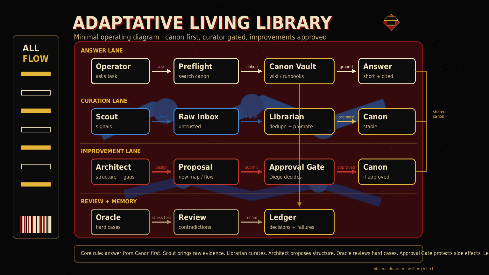

# Adaptative Living Library

A privacy-safe starter pack for building an **Adaptative Living Library** around Hermes Agent: a local Markdown knowledge base plus four bind-ready agent profiles.

It packages an operating pattern, not anyone's private data:

- **Scout**: researches topics and gathers signals into raw/inbox lanes.
- **Librarian**: curates raw notes into stable decisions, failures, runbooks, concepts, and maps.
- **Architect**: turns useful signals into gated improvement proposals.
- **Oracle**: keeps opt-in longitudinal context for tone and patterns, without diagnosis or hidden memory writes.

## Status

`v0.3.4` minimal architecture diagram + onboarding beta. Conservative by default:

- dry-run first;
- no automatic crons;
- no gateway restarts;
- no model/provider changes unless the operator runs onboarding with `--apply`;
- no active memory writes;
- no copied private data in the repository.

## What this repo is

A template and installer for a Hermes knowledge operating system:

```text
sessions/memory/topics -> raw onboarding scan -> Scout missions -> Librarian canon -> preflight before answers -> Architect proposals when useful
```

Use it when you want agents to stop relying on scattered chat history and start checking a curated local wiki before answering or acting.

## How it works



The important contract: **Scout collects**, **Librarian decides canon**, **Architect proposes**, and **Oracle adapts context**. Anything with side effects still waits for explicit operator approval.

Text fallback:

```text
Operator topics/models + optional read-only scans
  -> Raw + Inbox evidence
  -> Scout gathers source-backed signals
  -> Librarian dedupes, checks evidence, and promotes canon
  -> Canon feeds cheap preflight before answers/actions
  -> Architect proposes useful changes behind approval gates
  -> Oracle adds opt-in tone/pattern context, never authority
```
## Agent names

The pack creates these profiles and skills:

- `scout` — **Scout**
- `librarian` — **Librarian**
- `architect` — **Architect**
- `oracle` — **Oracle**

They are installed as profiles so you can later bind them to Telegram topics, Discord channels, cron jobs, or local CLI usage.

## Quick start

Dry-run first:

```bash
git clone https://github.com/YOUR_USER/adaptative-living-library
cd adaptative-living-library
./install.sh --dry-run
```

Install locally:

```bash
./install.sh --apply --target ~/.hermes --library-name adaptative-living-library --install-skills
```

Run onboarding in dry-run mode:

```bash
python3 scripts/onboard.py \
  --target ~/.hermes \
  --library-name adaptative-living-library \
  --topic "AI agents" \
  --topic "creative video workflows" \
  --scan-existing
```

Apply onboarding after reviewing the dry-run output:

```bash
python3 scripts/onboard.py \
  --apply \
  --target ~/.hermes \
  --library-name adaptative-living-library \
  --operator-name "Operator" \
  --provider openrouter \
  --main-model "anthropic/claude-sonnet-4" \
  --scout-model "openai/gpt-4.1-mini" \
  --librarian-model "anthropic/claude-sonnet-4" \
  --architect-model "anthropic/claude-sonnet-4" \
  --oracle-model "openai/gpt-4.1-mini" \
  --topic "AI agents" \
  --topic "creative video workflows" \
  --scan-existing
```

If you already have an Obsidian vault, link it directly:

```bash
python3 scripts/onboard.py --apply --obsidian-vault ~/Documents/Obsidian/MyVault
```

By default this creates a symlink named `Adaptative Living Library` inside the vault. If symlinks are unavailable, it writes a local linking note instead.

## What onboarding does

`scripts/onboard.py` is local and dry-run by default. With `--apply` it:

1. records chosen models for Scout, Librarian, Architect, and Oracle;
2. records explicit topics of interest for Scout;
3. scans local session/memory paths read-only when `--scan-existing` is enabled;
4. writes an initial raw onboarding note under `raw/onboarding/`;
5. writes `onboarding/adaptative-config.yaml` and `onboarding/profile-bindings.yaml`;
6. creates/updates bind-ready profile configs under `~/.hermes/profiles/{librarian,scout,architect,oracle}`;
7. optionally links an Obsidian vault.

It does **not** create crons, restart the gateway, edit global Hermes config, call LLMs, upload data, or write active memory stores.

## Installed layout

```text
~/.hermes/
├── libraries/adaptative-living-library/        # Markdown Living Library
├── profiles/librarian/                # profile ready to bind
├── profiles/scout/
├── profiles/architect/
├── profiles/oracle/
└── skills/community/adaptative-living-library/ # only if --install-skills is passed
```

## Cheap preflight policy

For non-trivial questions, an agent should check the local Adaptative Living Library before answering:

```bash
python3 ~/.hermes/libraries/adaptative-living-library/scripts/library_preflight.py "<query>" --limit 8
```

If relevant runbooks, decisions, failures, concepts, agents, or memory pages appear, read those first. Do **not** load the whole vault into context.

## Validation

Run the release-safe checks:

```bash
python3 scripts/release_check.py
```

Before publishing your fork, add your own denylist terms:

```bash
python3 scripts/release_check.py --deny "YOUR_NAME" --deny "YOUR_SERVER" --deny "YOUR_PRIVATE_PROJECT"
```

## Privacy stance

This pack is intentionally generic. The sanitizer checks for common leaks, but no scanner can prove privacy. Treat it as a guardrail, not a guarantee.

## Sync and Obsidian

See `sync-guides/` and `docs/onboarding.md`. Users can either keep the library under `~/.hermes/libraries/...` and symlink it into Obsidian, or install the library directly inside an Obsidian vault if they understand the tradeoff.

## License

MIT. See `LICENSE`.
