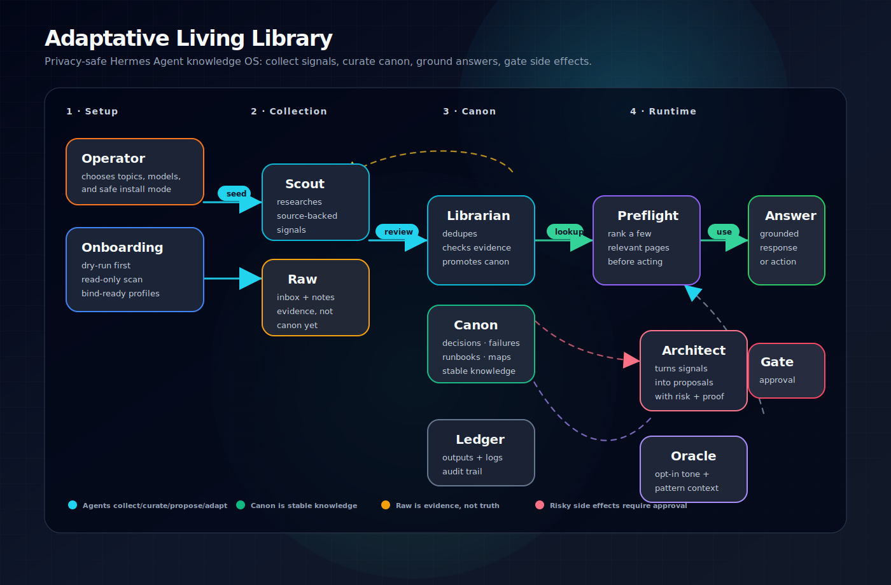

# Architecture

Adaptative Living Library uses a simple promotion pipeline:

```text
explicit interests + session/memory scan
  -> raw onboarding candidates
  -> Scout missions
  -> Librarian review
  -> stable canon page
  -> cheap preflight lookup
  -> grounded agent answer/action
  -> Architect proposal when useful now
```

## System diagram



### Reading the diagram

- **Onboarding** creates topics, raw seeds, model choices, and four bind-ready profiles without touching live config by default.
- **Scout** feeds the library with sourced signals, but does not decide what becomes stable knowledge.
- **Librarian** is the canon gate: it deduplicates, promotes, rejects, marks gaps, and records decisions.
- **Oracle** may inform tone/context when explicitly enabled; it is not a source of authority over canon.
- **Architect** receives only actionable opportunities and turns them into approval-gated proposals.
- **Preflight** keeps answers cheap and grounded: it ranks a few likely relevant canon pages instead of loading the whole vault.
- **Approval** is mandatory for risky side effects: crons, gateway restarts, provider/model changes, credentials, active memory writes, or external publishing.
## Roles

- **Scout** collects signals but does not decide canon.
- **Librarian** owns curation, de-duplication, contradictions, and promotion.
- **Architect** proposes changes but does not execute risky side effects by default.
- **Oracle** tracks opt-in longitudinal patterns as context, not as authority.

## Knowledge layers

- **Raw:** untrusted collection area.
- **Inbox:** human/agent submissions waiting for review.
- **Ledger/output:** dated evidence of work done.
- **Canon:** stable decisions, failures, runbooks, concepts, maps, and indexes.

## Why onboarding exists

A living library should not start blank. The operator gives explicit topics, chooses model routing, and optionally lets the onboarding script scan local sessions/memory read-only. The result is raw source material, not canon.

## Why preflight exists

Agents should not reread an entire vault for every question. The preflight script ranks likely relevant canon pages using metadata, headings, and tags, then the agent reads only a few high-signal pages.
